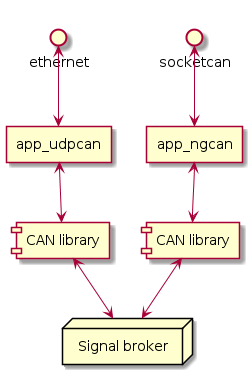

# CAN library

Features.
 * CAN frame decoding by descriptions.
 * Parse frame descriptions from files.
   * *DBC*, vector format.
   * *human*, json.
 * Signalpassing to `signalbase` broker.

At the time of writing this document, there are two applications using this library.
`app_ngcan` and `app_udpcan`.

